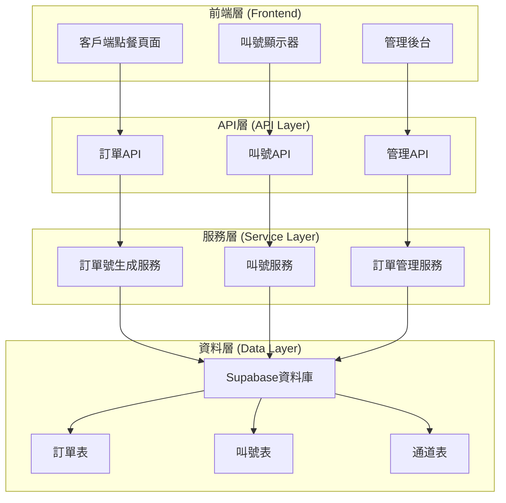

# 雙通道訂餐系統架構說明

## 系統概覽

本系統是一個專為小型餐廳設計的雙通道訂餐解決方案，支援線上點餐和現場點餐兩種模式，包含訂單管理、叫號系統、資料庫管理等核心功能。

## 系統架構圖

## 核心功能模組

### 1. 訂單號生成系統
- **格式**: `YYYYMMDD-通道代碼-序號`
- **範例**: 
  - `20241201-ON-001` (線上點餐第1號)
  - `20241201-WA-001` (現場點餐第1號)
- **支援通道**:
  - `ON`: 線上點餐
  - `WA`: 現場點餐

### 2. 叫號系統
- 自動為現場點餐生成叫號
- 支援叫號、完成等狀態管理
- 可擴展語音叫號功能

### 3. 訂單管理
- 雙通道訂單統一管理
- 訂單狀態追蹤
- 客戶資訊管理

### 4. 今日概覽
- 總訂單數統計
- 總營業額統計
- 線上點餐 vs 現場點餐比例
- 訂單狀態分布

## 資料庫結構

### 主要資料表
1. **order_channels**: 訂餐通道設定 (ON, WA)
2. **orders**: 訂單主檔
3. **order_items**: 訂單明細
4. **queue_numbers**: 叫號系統
5. **daily_counters**: 每日序號計數器

### 關聯關係
- 一個通道可以有多個訂單
- 一個訂單可以有多個明細項目
- 一個訂單可以有一個叫號（現場點餐）

## 技術特色

### 1. 輕量級設計
- 專為小型餐廳設計
- 簡單易用的管理介面
- 快速部署

### 2. 雙通道整合
- 線上點餐與現場點餐統一管理
- 避免訂單號衝突
- 清晰的業務流程

### 3. 即時性
- 即時訂單通知
- 即時叫號更新
- 即時統計更新

## 使用流程

### 線上點餐流程
1. 客戶在網站上選擇餐點
2. 填寫客戶資訊
3. 系統生成訂單號 (ON-XXX)
4. 訂單進入待處理狀態
5. 廚房處理訂單
6. 完成訂單

### 現場點餐流程
1. 客戶現場點餐
2. 工作人員輸入訂單
3. 系統生成訂單號 (WA-XXX) 和叫號
4. 訂單進入待處理狀態
5. 廚房處理訂單
6. 叫號通知客戶
7. 完成訂單

## 管理後台功能

### 1. 今日概覽
- 總訂單數
- 總營業額
- 線上點餐數量
- 現場點餐數量

### 2. 訂單管理
- 查看所有訂單
- 更新訂單狀態
- 按通道篩選
- 按狀態篩選

### 3. 叫號系統
- 查看等待叫號
- 執行叫號
- 完成叫號
- 叫號歷史

## 部署建議

### 小型餐廳 (1-5人)
- 使用 Supabase 免費方案
- 單一管理後台
- 基本叫號功能
- 平板或手機管理

### 中型餐廳 (5-15人)
- 升級 Supabase 方案
- 多設備管理後台
- 語音叫號系統
- 簡單報表功能

## 未來擴展方向

1. **語音叫號系統**
2. **行動裝置APP**
3. **會員系統**
4. **庫存管理**
5. **財務報表**
6. **客戶分析**
7. **多分店管理**

## 優勢特點

1. **簡單易用**: 專為非技術人員設計
2. **成本低廉**: 使用免費雲端服務
3. **快速部署**: 一鍵部署到 Vercel
4. **穩定可靠**: 基於成熟的技術棧
5. **可擴展**: 模組化設計，易於擴展 